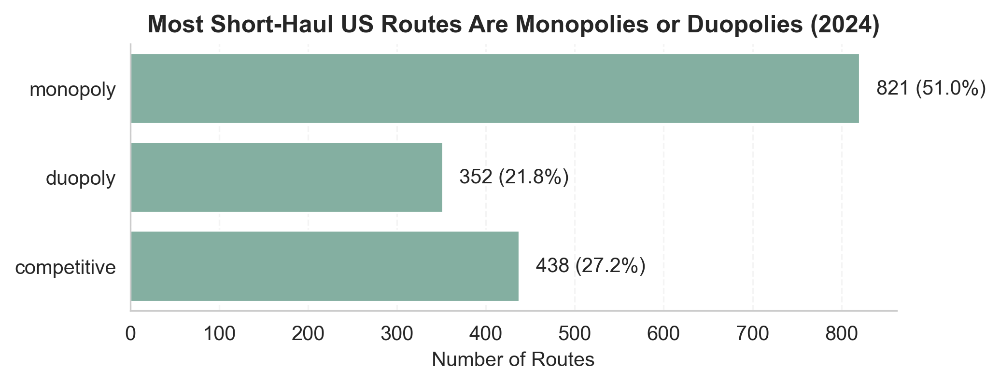
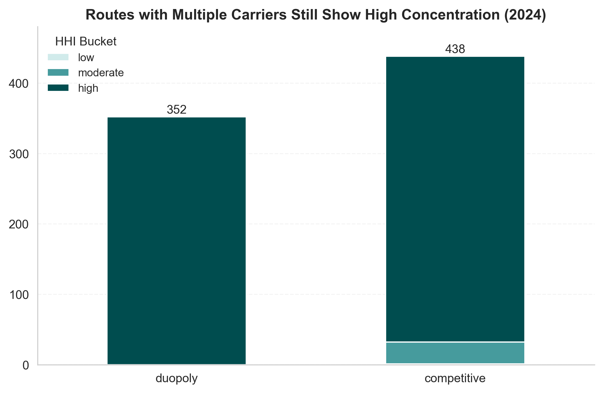
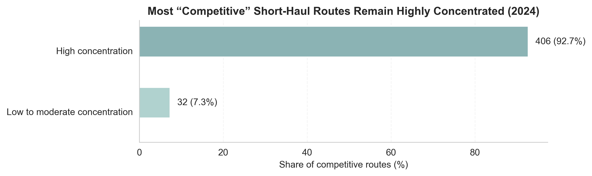

# Short-Haul Air Travel Economics (US, 2024)

*Analysis of market concentration on short-haul US airline routes using SQL, Python, and HHI metrics.*

## Project Overview

This project analyzes the competitive structure of short-haul airline routes in the United States.

Routes with multiple airlines are often assumed to be competitive. However, the presence of multiple carriers does not necessarily imply balanced market share. This analysis investigates whether routes that appear competitive based on carrier count are actually competitive when market concentration is considered.

Using route-level airline data for 2024, the project measures market concentration using the **Herfindahl-Hirschman Index (HHI)** and compares it against the number of carriers operating on each route.

The key finding: **even routes with three or more carriers remain highly concentrated in most cases when market share distribution is considered.**

---

## Data Sources

The project uses the U.S. Department of Transportation T-100 airline dataset published by Bureau of Transportation Statistics (BTS), which contains monthly operational statistics reported by U.S. air carriers.

The dataset includes route-level flight counts and passenger totals for each carrier.

## How to Run the Project

1. Load raw airline data into PostgreSQL.
2. Run preprocessing scripts to clean and standardize data.
3. Execute SQL analysis queries.
4. Run the Python visualization script to generate figures.

## Data Model

The analysis uses a relational dataset consisting of route-level airline activity.

### `fact_route_month`
Monthly airline activity by route and carrier.

Columns include:
- `route_id`
- `carrier`
- `flights_count`
- `passengers`
- `year`
- `month`

### `dim_route`
Route metadata.

- `route_id`
- `origin_airport`
- `dest_airport`
- `distance_km`

### `dim_airport`
Airport metadata.

- `airport_code`
- `region`
- `country`

---

## Filters Applied

The analysis focuses on **short-haul domestic US routes** with the following constraints:

- Distance between **300 km and 1200 km**
- **Year = 2024**
- Passenger carriers only
- **> 50 annual flights per carrier**
- **Passengers > 0**

These filters remove extremely small or irregular routes to focus on meaningful airline competition.

---

## Methodology

### 1. Route Competition Classification

Routes are categorized based on the number of airlines serving them:

| Carriers | Classification |
|----------|----------------|
| 1 | Monopoly |
| 2 | Duopoly |
| 3+ | Competitive |

---

### 2. Market Concentration

Market concentration is measured using the **Herfindahl-Hirschman Index (HHI)** calculated from each carrier's share of annual route-level flights.

HHI thresholds follow US Department of Justice guidelines:

| HHI | Market Structure |
|-----|------------------|
| <1500 | Low concentration |
| 1500–2500 | Moderate concentration |
| ≥2500 | High concentration |

---

## Key Findings

### Market Structure of Short-Haul Routes

Most short-haul routes are served by only one or two airlines.



Monopoly and duopoly routes account for the majority of the network.

---

### Concentration Among Routes with Multiple Airlines

Even when more than one carrier operates a route, the market is often dominated by a single airline.



Duopoly routes are almost always highly concentrated, and many routes with three or more carriers still show strong dominance by one airline.

---

### Core Insight

Among routes with **three or more airlines**, the vast majority still exhibit **high market concentration**.



Out of **438 routes classified as competitive**, **406 (~93%) remain highly concentrated**.

This demonstrates that **carrier count alone significantly overstates true market competition.**

## Limitations

1. **Flight counts used as market share proxy**
   HHI calculation uses flight counts, not passenger market share.

   This means that HHI is based on flights and may slightly misrepresent true passenger market share.

2. **Eligibility filter (>50 flights per carrier)**
   The filter was applied to avoid noise, however it can slightly understate competition on thin routes.

3. **Route definition ignores nearby airports**
   Routes are defined strictly as:
   - origin airport -> destination airport
   
   Example:
   - JFK–LAX
   - EWR–LAX

   These are treated as separate routes, even though some travelers consider them substitutes.
   
4. **Short-haul definition (300–1200 km)**
   The analysis only includes routes within this distance range, therefore the findings cannot be generalized to long-haul markets, which have different economics and competitive dynamics.

5. **Single-year snapshot (2024)**
   The analysis uses one year of data.
   
   Airline competition can change due to:
   - new route entries
   - airline exits
   - seasonal capacity changes

   A multi-year analysis could reveal longer-term trends.

---

## Project Workflow

The analysis pipeline consists of three stages:

1. **Data preparation (Python)**  
   Raw airline datasets are cleaned and standardized.

   ```bash
   python src/00_prepare_airports_seed.py
   python src/01_prepare_t100_clean.py
   ```

2. **Analytical modeling (SQL)**
   SQL scripts generate route-level competition and concentration metrics inside PostgreSQL.

   **Key outputs:**
   - route competition classification
   - Herfindahl–Hirschman Index (HHI)
   - concentration distribution by route type

3. **Visualization (Python)**
   Final figures are generated from SQL outputs.

   ```bash
   python src/02_generate_figures.py
   ```

   Generated charts are saved in:
   ```
   figures/
   ```

---

## Repository Structure

```text
short-haul-air-travel-economics-us-2024/

data_raw/
  README.md

data_processed/
  README.md

sql/
  13_route_competition_summary_us_distribution.sql
  17_share_of_competitive_routes_with_high_hhi.sql
  18_route_competition_and_hhi_matrix.sql

src/
  00_prepare_airports_seed.py
  01_prepare_t100_clean.py
  02_generate_figures.py

figures/
  fig01_route_competition_distribution.png
  fig02_hhi_distribution_by_competition_bucket.png
  fig03_share_of_competitive_routes_with_high_hhi.png

README.md
.gitignore
```

---

## Tools Used
- SQL (PostgreSQL) – data modeling and analysis
- Python (pandas, matplotlib, seaborn) – visualization
- GitHub – project structure and presentation